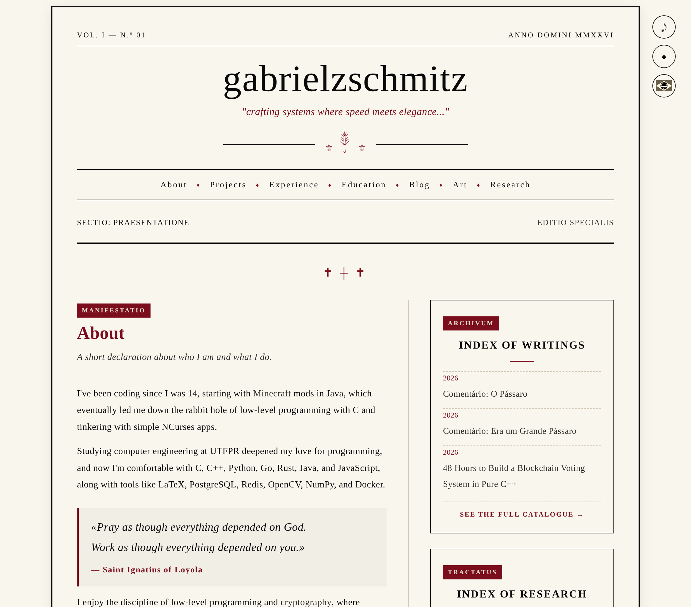
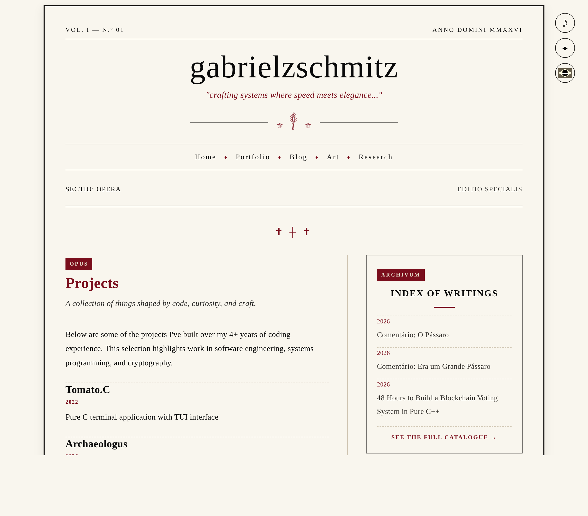
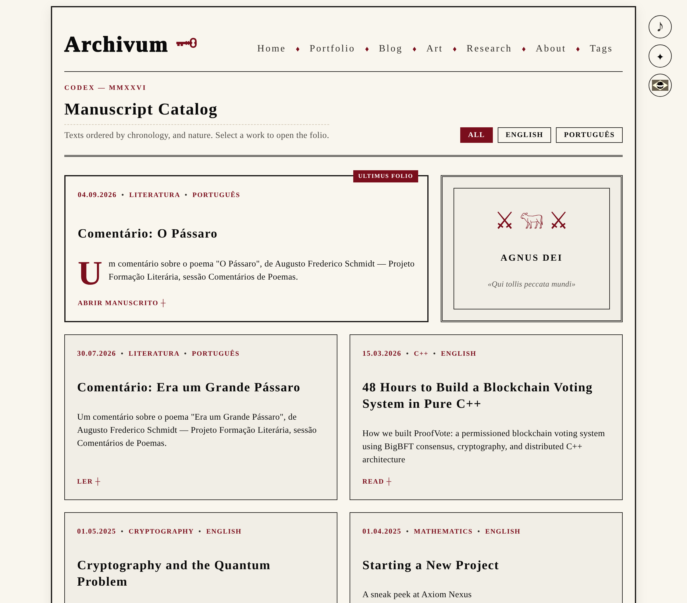
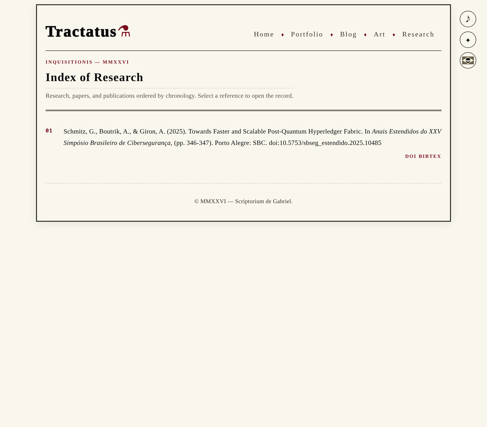
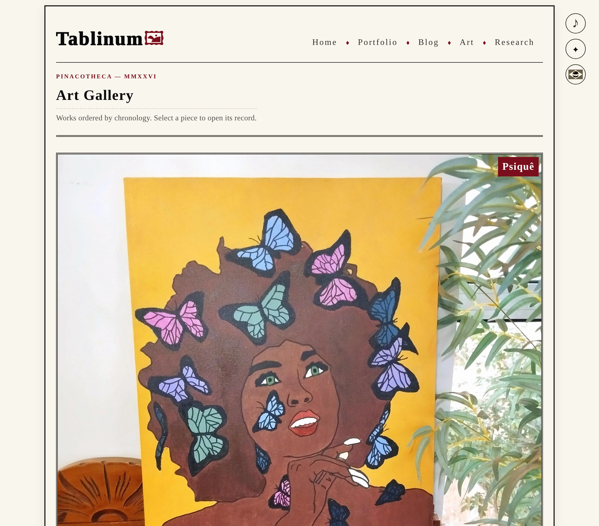

# Personal Website


<a href="./LICENSE"></a>
<a href="https://www.buymeacoffee.com/gabrielzschmitz" target="_blank"></a>
<a href="https://github.com/gabrielzschmitz/gabrielzschmitz-website"></a>

This repository contains the full source code for my personal website. It is
built as a single [Zola](https://www.getzola.org/) site with
[BibInject](https://github.com/gabrielzschmitz/BibInject) for bibliography
injection, serving an _about page_ at `/`, the
_portfolio_ at `/portfolio`, where projects, experience, and education live,
the _blog_ at `/blog`, where all long-form writing posts live, the _research
page_ at `/research`, where publications are rendered using BibInject, and
the _art gallery_ at `/art`.

## Overview


### Main Page (`/`)

<p align="center">
  
</p>


### Portfolio (`/portfolio`)

<p align="center">
  
</p>


### Blog (`/blog`)

<p align="center">
  
</p>

### Research Page (`/research`)

<p align="center">
  
</p>

### Art Gallery (`/art`)

<p align="center">
  
</p>

## Project Structure

<details>
<summary>Project Structure</summary>

```text
.
├── config.toml           # Zola configuration; [extra.latin] keeps site-wide Latin labels
├── build.sh              # Pipeline: art pages → Zola → BibInject
├── vercel.json           # Vercel install/build commands; output = ./public
├── package.json          # @upstash/redis (view counter client)
├── api/
│   └── views/[slug].js   # Vercel serverless function: Upstash Redis view counter
├── content/
│   ├── _index.md         # Site root; template = home.html
│   ├── portfolio/        # Portfolio section; template = portfolio.html
│   ├── blog/             # Blog posts, each a folder with index.md + media
│   ├── research/         # Research section; template = research.html
│   └── art/              # Art section; _index.md committed, pages generated
├── templates/
│   ├── home.html         # About home page (/)
│   ├── portfolio.html    # Portfolio work page (/portfolio)
│   ├── base.html         # Blog layout (header, footer, shared partials)
│   ├── blog_home.html    # /blog catalogue (featured, grid, language filter)
│   ├── research.html     # /research page (BibInject target)
│   ├── art.html          # /art gallery
│   ├── artwork.html      # Single artwork page
│   ├── page.html         # Post/page layout
│   ├── section.html      # Generic section layout
│   ├── 404.html          # 404 page
│   ├── components.html   # Global gsz.* Tera v2 components
│   ├── rss.xml           # Feed template
│   ├── tags/             # Taxonomy list and single templates
│   └── partials/         # Reusable blocks (head, analytics, theme, controls, player)
├── static/
│   ├── art/               # Artwork images, one dir per piece (mirrors /art/<slug>/)
│   ├── certificates/      # PDF certificates
│   ├── css/
│   │   ├── core/          # tokens, base, layout, controls, emblem, player, references
│   │   ├── pages/         # one stylesheet per page type
│   │   └── effects/       # cube.css (Minecraft effect)
│   ├── fonts/             # Self-hosted woff2 + fonts.css
│   ├── images/            # icons/ (logos, favicon, cursor) and screenshots/
│   ├── js/                # Behaviour modules (lang, theme, player, roman, effects, ...)
│   ├── music/             # Streamed tracks (playlist emitted to public/ by build.sh)
│   ├── research/          # ref.bib (BibInject source) + refspec/mini.html (sidebar layout)
│   ├── resume/            # LaTeX source + PDF résumé and logo
│   ├── robots.txt
│   └── under-construction.html
└── scripts/
    ├── art.json           # Art gallery registry (source of truth for generate_art.py)
    ├── generate_art.py    # Builds content/art/ pages from scripts/art.json
    ├── credits.json       # Music track credits (consumed by build.sh playlist task)
    └── ATTRIBUTION.md     # Track attribution, licensing, takedown notice
```

Generated at build time:

- `content/art/*/` — created by `scripts/generate_art.py` from `scripts/art.json` (gitignored).
- `public/` — site output (gitignored); references from `static/research/ref.bib` and the music playlist are injected into it by `build.sh`.

</details>

## Build

The site is built with **[Zola](https://www.getzola.org/)** and research
references are injected at build time by
**[BibInject](https://github.com/gabrielzschmitz/BibInject)**.

### Requirements

- **Zola**: used to build the documentation site.
- **Python 3 with `venv`**: used by
  [BibInject](https://github.com/gabrielzschmitz/BibInject) to manage its
  virtual environment.

<details>
<summary>Install dependencies</summary>

#### Arch Linux

```bash
sudo pacman -S python zola
```

#### Ubuntu / Debian

```bash
sudo apt update
sudo apt install python3 python3-venv zola
```

> On older Ubuntu/Debian releases, `zola` may not be available in the default
> repositories. In that case, install Zola separately from its official
> releases.

#### Alpine Linux

```bash
sudo apk add python3 py3-virtualenv zola
```

#### macOS

Using [Homebrew](https://brew.sh/):

```bash
brew install python zola
```

</details>

### Production

```sh
./build.sh
```

Builds the site with Zola and injects the research references. Output:
`./public`.

### Development

```sh
./build.sh --serve
```

Watches for changes, rebuilds automatically, and serves locally on port `1111`.

### Screenshots

```sh
./build.sh --screenshots
```

Builds the site, serves it locally, and captures the README demo images (the
`/`, `/portfolio`, `/blog`, `/research`, and `/art` pages) into
`./static/images/screenshots/*-demo.png`. Requires a Chromium-based browser and
Python 3 with `http.server`.

Tunable via environment variables:

- `SHOT_SIZE` — output PNG size (default `2254x1980`)
- `SHOT_SCALE` — device scale factor (default `2`)
- `SHOT_PAGES` — space-separated `path=output.png` map to override which pages
  are captured
- `PORT` — local port to serve the build on (default `1111`)

### BibInject

[BibInject](https://github.com/gabrielzschmitz/BibInject) is downloaded from
its pinned GitHub release into a cache directory . Each build updates its
`mini` refspec with the repo's `static/research/refspec/mini.html` to keep the sidebar
layout in sync.

## License

This project is licensed under the MIT License. The images included in this
project are licensed under the Creative Commons Attribution 4.0 License. See
the [LICENSE](LICENSE) file for details.

### Music

The music tracks included under [`static/music`](static/music)
are **not** owned by this project and are not covered by the project's MIT
License. They are reproduced solely for streaming purposes with attribution to
their respective artists and rights holders.

For full credits, licensing information, and the takedown notice, see
[`ATTRIBUTION.md`](scripts/ATTRIBUTION.md).

If you hold the rights to any track included in this project and would like it
removed, please contact
**[gabrielzschmitz@protonmail.com](mailto:gabrielzschmitz@protonmail.com)**.
